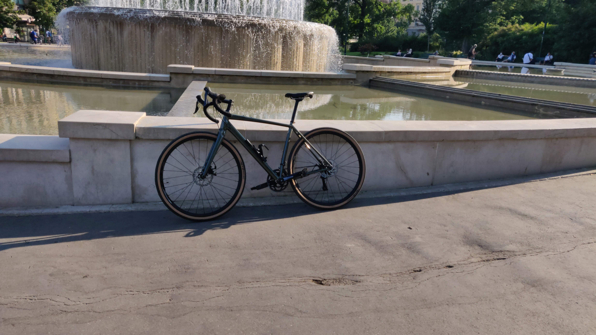
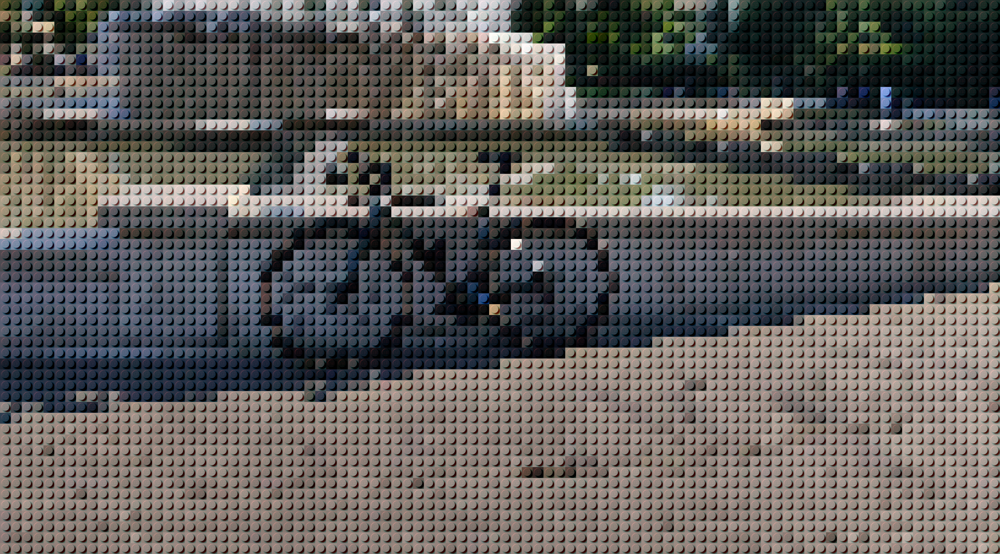

LEGOLIZE
========

Developed with python version 3.8.7

Install dependencies

```
pip install -r requirements.txt
```

Execute

```
LOG_LEVEL=DEBUG python src/main.py -f photos/byke.jpeg -w 50 -h 50
```





### Greetings

[Lego Color from Rebrickable](https://rebrickable.com/downloads/)